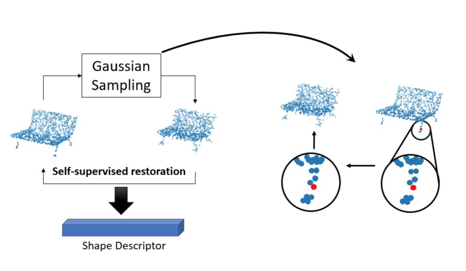
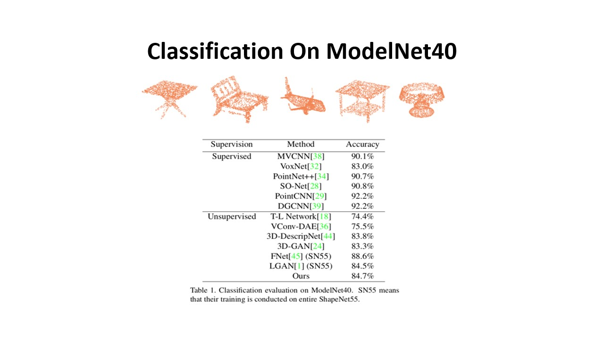
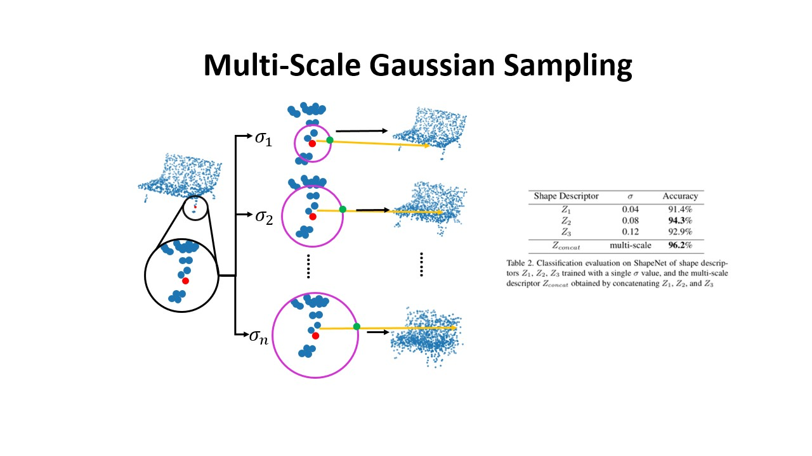
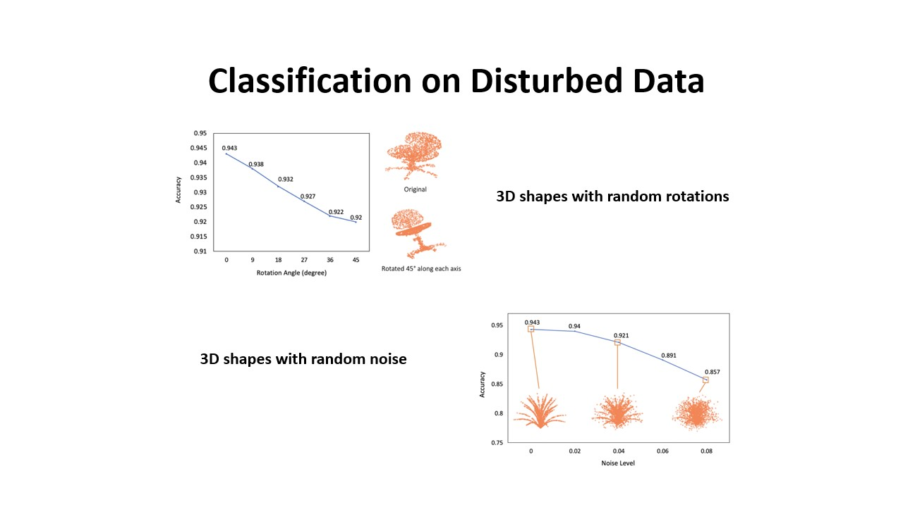
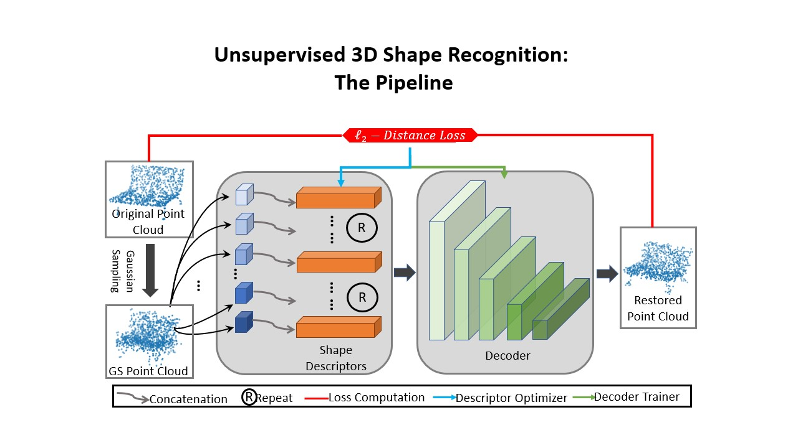

# Unsupervised Deep Shape Descriptor with Point Distribution Learning 
&nbsp; &nbsp;This repository contains sampling code for the 'Unsupervised Deep Shape Descriptor with Point Distribution Learning'. It contains implemetation details and important infomation for training and testing. The code has just been cleaned, reoredered and separated from a larger project, please make a post in Issues if you have any question about using it. 

## Overview
&nbsp; &nbsp;This work focuses on unsupervised 3D point cloud descriptor/feature computation. The proposed learning based approach treats each point as a Gaussian and introduces a process called 'Gaussian Sampling' which applies multiple 'disruptions' to each point. Then an auto-decoder model is leveraged to guess the original location of each point, through which the geometric information of the shape is learned. 
    

   
## Data
&nbsp; &nbsp; On contrary to using the entire [ShapeNet](https://www.shapenet.org/) subset which contains 55 categories and 57,000 data, we follow the same setting as in [3DGAN](http://3dgan.csail.mit.edu/) where only seven categories from the [ShapeNet](https://www.shapenet.org/) are used in training and evaluation is on the entire ModelNet40. We provide processed partial data in the following link)

Training: [A subset](https://drive.google.com/open?id=1Pmu9e70uKBvxgBYbjU8GxuzLY3xWPc0x) consist of 7 categories from ShapeNet.    
Evaluation: [ModelNet40 Aligned](https://modelnet.cs.princeton.edu/)  

&nbsp; &nbsp;In the ablation study, the evalution can be conducted on the [ShapeNet set](https://drive.google.com/open?id=1Pmu9e70uKBvxgBYbjU8GxuzLY3xWPc0x) includes 16 categories and 15000 data in total.

Training and testing Details
----------------------
&nbsp; &nbsp;The entire pipline involves two phases: decoder model training and descriptor computation. 

During model training, we use 7 major categories from ShapeNet. Beware that the learning rate for the descriptors should be higher than that with the decoder so that descriptors are forced to capture information rather than overfitting the decoder model itself.    
   
During descriptor computation, the descriptors obtained in the previous model training will be discarded. The learning rate of the descriptor will be set higher than previous stage for fast convergence while the model parameters remain fixed. 

For each dataset involved, the hyper parameters should be tuned for the optimal performance. The evaluation over generated descriptors is performed with the default function provided by sklearn.

Dependencies
-----------------
We use Pytorch 1.3 for our model implementation.  The evalution is performed with the default function provided by sklearn.

-matplotlib 

-numpy 

-sklearn 

-open3d  

Links
----------------
[Paper](https://drive.google.com/open?id=1OjtTes9h4y1X0_yZNrWCmUTsuXgI4Ev1)|
[Slides](https://drive.google.com/open?id=14K5LHh_mtf7znlY2Re83OcQicpG-eF1C)|
[Teaser](https://drive.google.com/open?id=1cSuHC03yJhB2QISNpjMzAtYVPydVXkqi)

Reference
---------------
@article{unded2020, 
  title={Unsupervised Deep Shape Descriptor with Point Distribution Learning},  
  author={Shi, Yi and Xu, Mengchen and Yuan, Shuaihang and Fang, Yi},  
  journal={},   
  volume={},  
  number={},  
  pages={},   
  year={2020}, 
}

